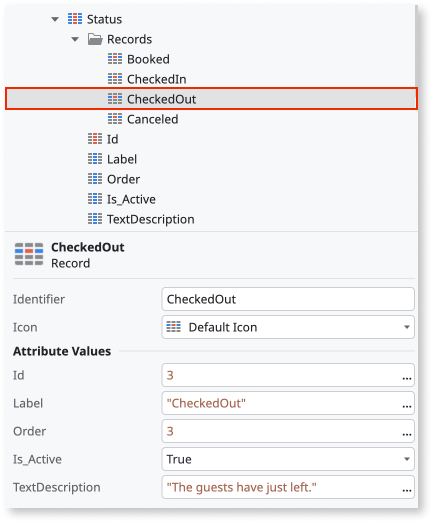

# Static Entities

A **Static Entity** consists of a set of named values. Think of Static Entities as literal values stored in a database whose scope is always global. The **Records** folder of the Static Entity holds the data, and the Attributes define the structure of the data.

The only action available for the Static Entities is the **Get&lt;StaticEntity&gt;** action, because OutSystems manages the data persistence for you.

When modeling your data, keep in mind that Static Entities can only contain foreign keys of other Static Entities. For more information check out [Entity Relationships](relationship/relationships.md).

## Create a Static Entity

To add a Static Entity to your app, do the following in ODC Studio:

1. Navigate to the **Data** tab, right-click on the **Entities** folder, and select **Add Static Entity to Database**.

    

    Start typing to enter the name. Press **Enter** to confirm.

1. Each new Static Entity gets the [default set of Attributes](#default-attributes). To add a new Attribute, right-click on your Static Entity, and select **Add Entity Attribute**. Then, edit the Attribute name and data type.

1. Finally, add some data to your Static Entity. Right-click on the Static Entity, and select **Add Record**. Enter the properties of the Record.

## Default Attributes

ODC Studio creates the following Attributes automatically:

**Id**
:   Identifies a record and is always unique. Using auto-number is not recommended, as it might generate issues in complex scenarios.

**Label**
:   Holds a value to display in an application.

**Order**
:   Defines the order for displaying the records to the end-user.

**Is_Active**
:   Defines whether a record is available during runtime. For example, the records with **Is_Active** set to false aren't used when scaffolding uses the Static Entity.

## Convert Static Entity to Entity

You can convert existing Static Entities to Entities. To convert a Static Entity to Entity, right-click on the Static Entity, navigate to the **Advanced** help menu and then select **Convert to Entity**. 

After converting a Static Entity to an Entity:

* The records from the Static Entity become available through database queries, via Aggregate or SQL Query 
* The **Records** folder is no longer available in ODC Studio

Note that it's also possible to convert an Entity to Static Entity.

## Example

Use Static Entities when you need a predefined, or constant, set of values. For example, in a hotel app, you probably need some reservation statuses: "booked", "checked in", "checked out", and "canceled". You also need the default descriptions for the statuses like "The guests have just left." for "checked out".

Your Static Entity Status may look like this:

The Records folder of your Static Entity contains all statuses you have created. If you select "CheckedOut", the Properties Editor shows the following details:

The Identifier for the checked out status is `CheckedOut` and the Label is `"Checked-Out"`. The field TextDescription is the custom field and has the string value `"The guests have just left."`.

You can access the record for checked out status by referencing its Identifier, like this: `Entities.Status.CheckedOut`.
