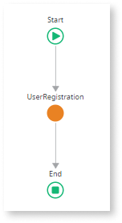

# Best practices for logic

In OutSystems, your apps' logic is implemented through actions. Follow these recommendations to ensure efficiency and good performance.

## Avoid multiple server calls in a client action flow { #multiple-server-calls }

Multiple server aggregates or server action requests inside client actions can lead to performance issues. Each call results in a separate server request, leading to numerous round trips between the client and server, which can increase latency. 

The following is an example of a client action flow with several sequenced server calls, which is not a good practice:

### Recommendation

If you need to make multiple server calls in a client action, wrap all those server calls into a single server action and use that in the client action instead:

### Benefits

Having all required server logic in a single server action reduces the number of server requests, which improves your app's performance.

## Don't add aggregates or SQL queries inside a cycle { #aggregates-inside-cycle }

Aggregates or SQL queries inside a For Each cycle mean repeated database calls for each iteration. This results in significant performance degradation, particularly with large datasets or nested loops.

### Recommendations

When adding aggregates or SQL queries to an action flow, consider the following:

* Avoid executing aggregates or SQL queries inside a For Each cycle. 

* Instead of adding an aggregate or SQL query inside a cycle, add a more complex one that gets all the needed information before the cycle.

* If you have an aggregate to fetch the master entity before the cycle, followed by another aggregate inside the cycle to fetch the details, consider eliminating the inner aggregate. Add a join to the outer aggregate instead.

### Benefits

Keeping database calls outside the cycle prevents you from executing the same call repeatedly, thus improving performance.

## Avoid hard-coded values { #hard-coded-values }

Using hard-coded values makes your app's code difficult to understand and maintain:

* Hard-coded literals are difficult to locate if you need to change their values.

* Using hard-coded True/False conditions can lead to unreachable logic or cause unexpected behavior, such as forgotten feature flags forcing the execution of a specific If branch.

### Recommendations

Avoid hard-coded values in your app's code. Depending on the use case, use one of the following options instead:

* Use [static entities](../data/modeling/entity-static.md) to hold a predefined set of values, such as product categories, or a set of statuses (for example, `New`, `In Progress`, `Pending`, or `Closed`). This promotes strong typing that is less error-prone.

* Use [settings](../../manage-platform-app-lifecycle/configuration-management.md#managing-settings) for app configurations and other application-wide values that don't change frequently, such as email address, or feature toggle flags.

* Use [entities](../data/modeling/entity.md) for other app configurations that can change frequently.

* Use parameters in your SQL query statements.

### Benefits

Avoiding hard-coded values makes your code easier to understand and maintain.
