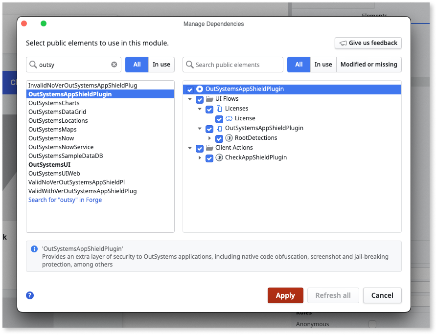
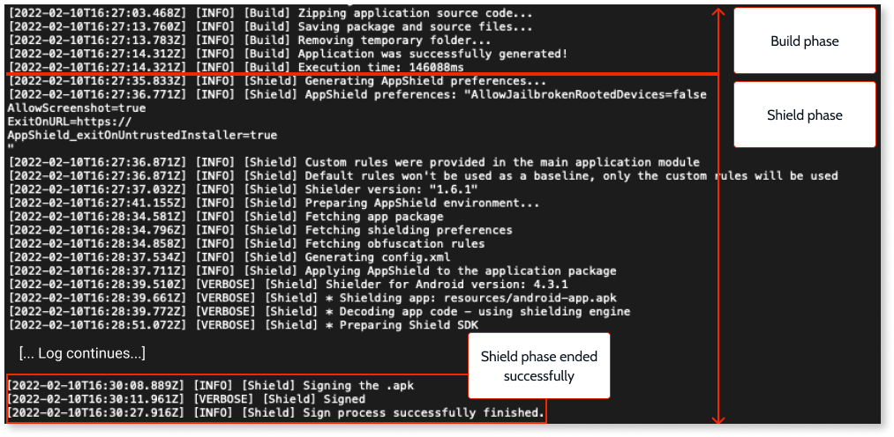

# Harden the protection of mobile apps with AppShield

<div class="info" markdown="1">

Applies only to Mobile Apps.

</div>

**OutSystems AppShield** is a licensed plugin available from the **Forge**. **AppShield** lets you harden the protection of your native Android and iOS apps. **AppShield** integrates with the Mobile Apps Build Service (MABS version 9.0 or later), adding app protection at runtime and rest.

<div class="info" markdown="1">

To use **OutSystems AppShield**, you must have a license. If you still need to get a license, contact the sales team.

</div>

By using **AppShield**, you can prevent:

* Code from being injected into your app.
* Users from taking screenshots of the data.
* Data from being hijacked.

When the user launches a hardened app, the app performs multiple checks. Some examples of these checks are root and repackaging detection meaning the app takes slightly more time to launch, especially when starting for the first time. The start time varies depending on multiple factors, such as device hardware and app complexity.

To ensure your app users have protection against the latest security vulnerabilities, **OutSystems** provides continuous updates to **AppShield**.

## Understanding the AppShield life cycle

Before you install and use **AppShield**, it's important to understand the release cycle and how it improves security. For example, suppose you have a mobile banking application and your app data must always be secure, but your version of **AppShield** needs to be updated. OutSystems regularly updates **AppShield** and strongly recommends that you always install the latest version of **AppShield** in your environment. Then release a new build of your app to your users.

To identify the **AppShield** plugin releases, OutSystems uses the following tags:

* Stable
* Current
* Expiring
* Discontinued

The following list describes the tags:

* **Stable and Current** - This is the active version and has up-to-date protection. OutSystems **supports** this version and highly recommends that you install and use this version.
* **Stable** - You can use this version, but the protection isn't current. OutSystems **doesn't support** this version. You can build an app, but you get a warning message when you try to build the app.
* **Stable and Expiring** - This version becomes discontinued in three months. OutSystems **doesn't support** this version, but you can build an app with it. If you use this version, a warning message displays advising you to update to the most current version before the expiration date. Once this version **discontinues**, you won't be able to build your app with it.
* **Discontinued** - This plugin version is out of date. OutSystems security mechanisms prevent you from creating a new build for your users. OutSystems **doesn't support** this version.

The following diagram shows how release versions work in **AppShield**.


<div class="warning" markdown="1">

To keep your apps and data secure, OutSystems recommends that you always use the current version of the **AppShield** plugin. Go to the Versions tab of the plugin Forge page to get the current version.

</div>

## Prerequisites

To ensure the integrity and protection of your apps with **AppShield**, you must meet the following requirements.

* You have a license for **AppShield**.

* You're using MABS 9.0 or later. 

    For more information about the supported operating systems, see [MABS and mobile operating systems life cycles](https://success.outsystems.com/Support/Release_Notes/Mobile_Apps_Build_Service_Versions).

## How to enable AppShield on your mobile apps

To protect your mobile app using the AppShield plugin, follow these steps:

1. **Install the AppShield** plugin in your environment.
    
    To download the plugin, go to [OutSystems AppShield](https://www.outsystems.com/forge/list?q=shield) in Forge, and click install.     

1. **Add the dependencies for AppShield** plugin on each mobile app you want to protect.

    

1. **Generate and distribute a new mobile package** protected with AppShield.

Note the following:

* All AppShield capabilities, except [Screen reader](protection-features-description.md#android-screen-reader) and [Keylogger](protection-features-description.md#android-untrusted-keyboard) detection are enabled by default.
* If any additional configuration is needed, go to the [Configuration](#configuration) section.
* The app file size increases after hardening the security.
* MABS takes more time to create a hardened build.

<div class="info" markdown="1">

To learn more about adding mobile plugins to your app, see [Adding plugins](../plugins/intro.md).

</div>

## Supported features

These are the features you can use with the current release of the **AppShield** plugin.

### Android

Protections that are available for Android builds.

* Root detection
* Repackaging detection
* Code obfuscation
* Code injection protection
* Debugger protection
* Emulator detection
* Key logger protection
* Screen reader detection
* Untrusted keyboard detection
* Screenshot protection
* Task hijacking protection

### iOS

Protections that are available for iOS builds.

* Jailbreak detection
* Repackaging detection
* Code injection protection
* Debugger protection
* Screen mirroring detection
* Screenshot protection ([see limitation](#general))

## Configuration

**AppShield** is on by default when you install the plugin. You can turn it off in one or more environments for testing purposes.

* To turn off **AppShield** in one or more environments, edit the **DisableAppShielding** settings in **ODC Portal** for the environment. For example, turning off the plugin in the development environment lets you run the app in emulators or debug the app.

Here is an example of the JSON for **Extensibility Configurations**. You can use different sections for iOS and Android.

```
{
    "preferences": {
        "global": [
            {
                "name": "DisableAppShielding",
                "value": "false"
            },
            {
                "name": "AllowJailbrokenRootedDevices",
                "value": "false"
            },
            {
                "name": "ExitOnURL",
                "value": "https://example.com/protectionblocker/landing-page"
            }
        ],
        "android": [
            {
                "name": "AllowJailbrokenRootedDevices",
                "value": "true"
            },
            {
                "name": "AllowScreenshot",
                "value": "false"
            },
            {
                "name": "BlockUntrustedKeyboards",
                "value": "true"
            },
            {
                "name": "BlockUntrustedScreenreaders",
                "value": "true"
            }
        ],
        "ios": [
            {
                "name": "AllowJailbrokenRootedDevices",
                "value": "true"
            },
            {
                "name": "AllowScreenshot",
                "value": "false"
            }
        ]
    }
}
```

### Configuration reference

These are the values available in the **AppShield** configuration JSON.

| Value                           | Type         | OS           | Description                                                                                       |
| ------------------------------- | ------------ | ------------ | ------------------------------------------------------------------------------------------------- |
| AllowJailbrokenRootedDevices    | boolean      | iOS, Android | If set to true, allows users to run the app on the jailbroken devices.                            |
| AllowScreenshot                 | boolean      | iOS, Android | If set to true, allows users to take screenshots of the app.                                      |
| AppShieldObfuscationRules       | Text(base46) | iOS, Android | Custom rules for obfuscation. See [Creating custom obfuscation rules](obfuscate-custom-rules.md). |
| BlockUntrustedKeyboards         | boolean      | Android      | If set to true, detects and blocks untrusted keyboards.                                           |
| BlockUntrustedScreenreaders     | boolean      | Android      | If set to true, detects and blocks untrusted screen readers.                                      |
| DisableAppShielding             | boolean      | iOS, Android | Activates or deactivates App Shield.
 | ExitOnURL | URL value | iOS, Android|If an app feature is blocked due to a configured policy of the **AppShield** plugin, the default browser will open the URL which may explain the problem to the user. See ExitOnURL for additional information.                                                           |
| GooglePlayAppSigningCertificate | Text(Base64) | Android | Google Play App Signing certificate.                                                              |
| RemoveQueryAllPackagesPermission | boolean | Android | If set to true, it removes the app ability to check other installed applications. See more information [here](query-all-packages.md).                                                              |
| android                         | JSON value   | Android      | The key denoting values that apply to the Android devices.                                        |
| global                          | JSON value   | iOS, Android | Settings in this section apply to both Android and iOS builds.                                    |
| ios                             | JSON value   | iOS          | The key denoting values that apply to the iOS devices.                                            |

## Check if app with AppShield builds successfully

To ensure that your build passes the shield phase, check your [app’s build logs](../creating-mobile-package.md#download-mobile-app-build-logs--download-mobile-app-build-logs).

When you trigger a build with AppShield enabled and correctly configured, MABS includes a **shield phase** while generating the app's mobile package.

The shield phase occurs after the build phase, and a message at the end of the log file lets you know if the shield phase is successful.



## Obfuscation

The limitations that are specific to the obfuscation.

* The plugin obfuscates only the supported **OutSystems** mobile plugins.
* The plugin obfuscates native Android logs in ODC Portal. You need to use an external tool to deobfuscate the logs.
* JavaScript files obfuscation isn't supported.
* Native iOS bitcode obfuscation isn't supported.
* You need to contact Support to get the mapping files.

## Limitations

**AppShield** has the following limitations.

### General

* The IOS plugin doesn't block user-initiated screenshots; it only notifies the app that a screenshot was taken. OutSystems currently doesn't support this event. However, **AppShield** blocks taking screenshots of the iOS App Switcher.

* After MABS creates a build with the **AppShield** plugin active and signs the build, you can't sign that build again manually because the app would recognize that as a sign of tampering.

## Google Play App Signing

<div class="info" markdown="1">

This applies to apps for Google Play Store with the app signing feature enabled.

</div>

One of the security features of **AppShield** is repackaging detection. This protection prevents re-signing of the app package but also causes incompatibility with the Google Play App Signing. You can fix this by providing information about the certificate in the **AppShield** settings.

In the **Android section** of the Extensibility Configurations JSON, add the **name** with `GooglePlayAppSigningCertificate` and the **value** with the public key. Here is an example:

```
{
    "preferences": {
        "android": [
            {
                "name": "GooglePlayAppSigningCertificate",
                "value": "[public-key-certificate]"
            }
        ]
    }
}
```

To get the values for **[public-key-certificate]**, do the following:

1. From Google Play Console download the **App Signing Certificate** available in the **App Signing** fragment.

1. Convert the **.der** file to **.pem** by running the command `openssl x509 -inform der -in deployment_cert.der -out certificate.pem`. You should now have a **certificate.pem** file.

1. Open the **certificate.pem** file in a text editor and copy the content between **-BEGIN CERTIFICATE-** and **-END CERTIFICATE-**.

After these changes steps, generate a new build of your mobile app.

<div class="warning" markdown="1">

If you generate an app in MABS with Play App Signing on, you need to sign the app via Google Play before you install it on your device. An unsigned app won't work, even if you install it by running the installer directly on the device.

</div>
