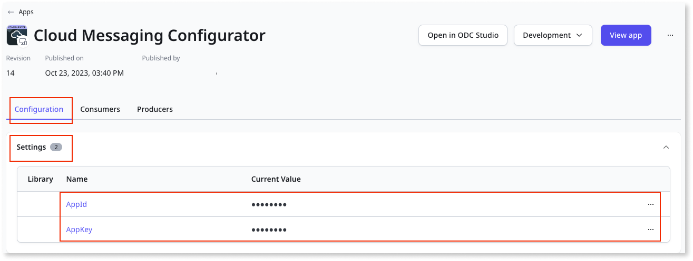
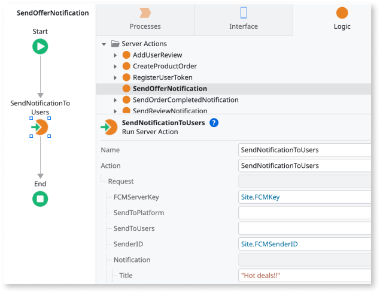
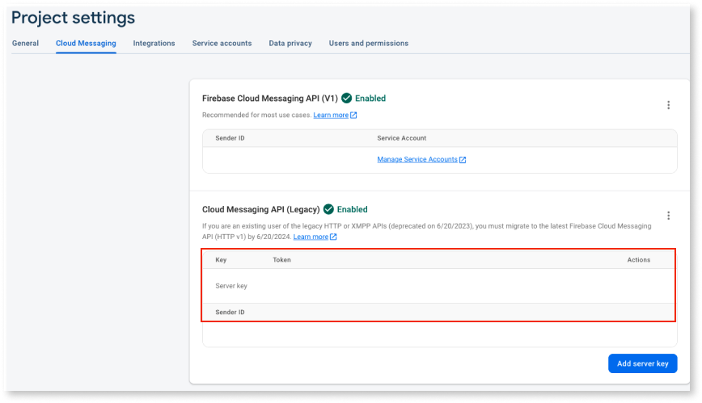
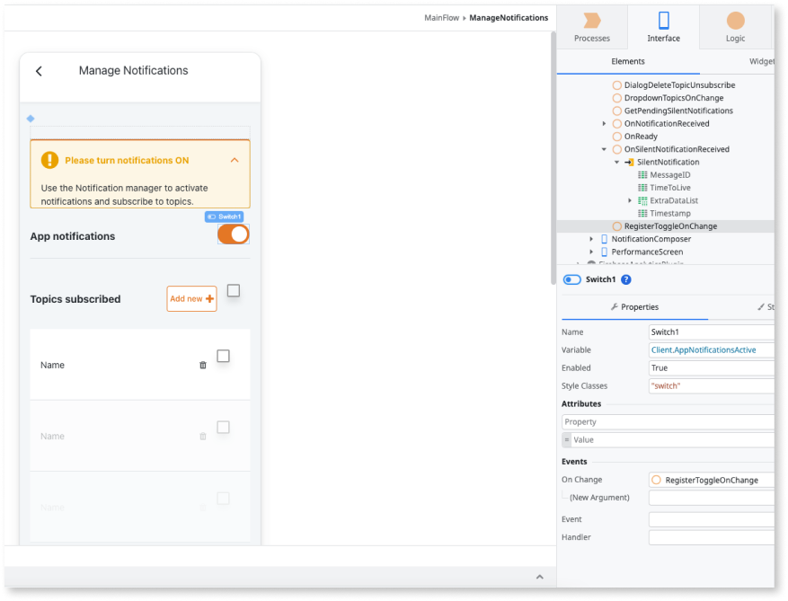
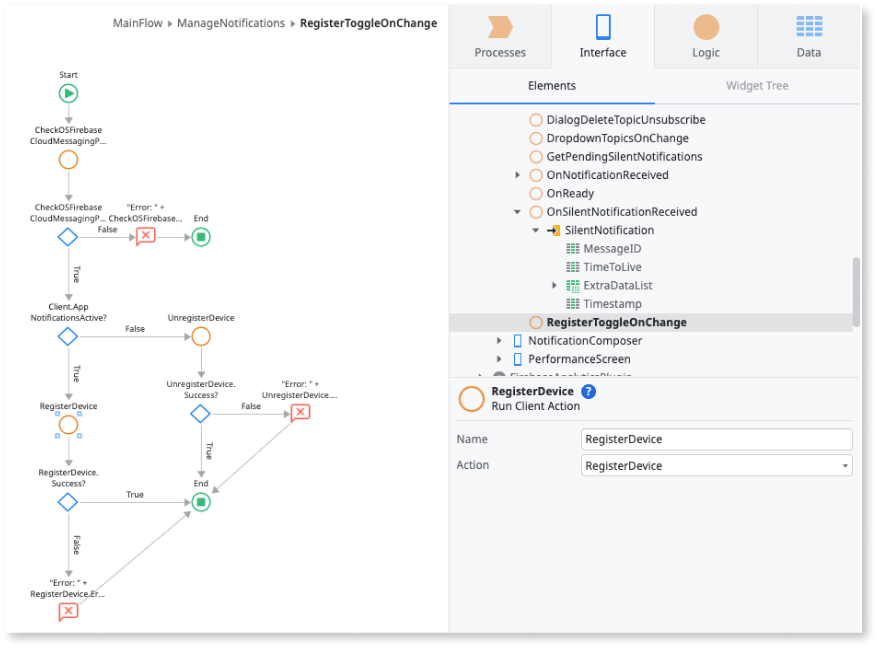
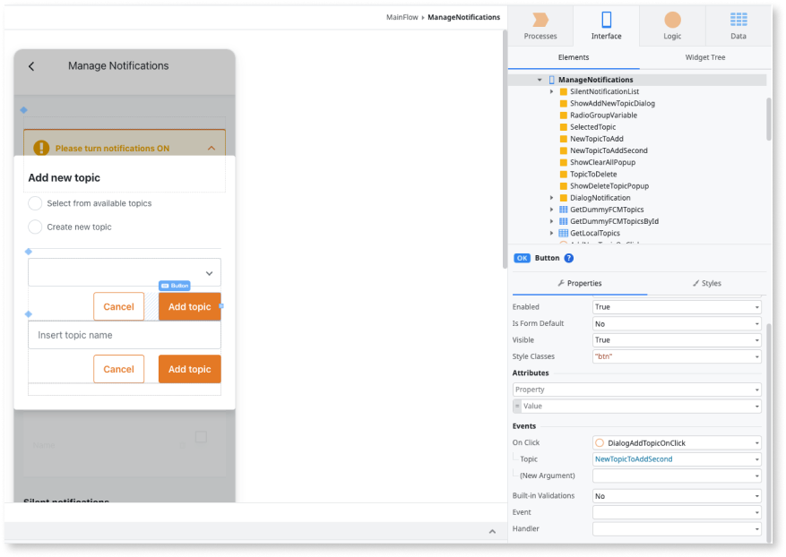
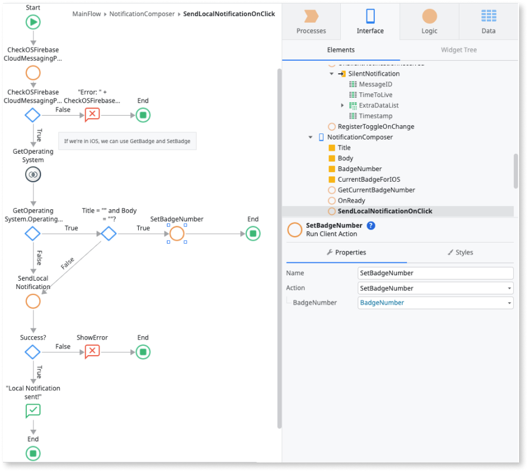

# Firebase Cloud Messaging Plugin

The Firebase Cloud Messaging plugin lets you set a notification experience that starts the Firebase cross-platform messaging solution. This plugin lets you send normal and silent notifications to your mobile app users. Normal notifications can include customizable actions and sounds.

<div class="info" markdown="1">

You can download the Firebase Cloud Messaging Plugin from [Forge](https://www.outsystems.com/forge/).

</div>

Normal notifications have a UI that displays visual and auditory cues. The cues either display in the notifications area of the app or in the scope of the app. Silent notifications don't display any visual cues. Notifications can deliver a data package to the app (called extra data) in the form of a key-value pairs list.

OutSystems also has notification features you can use to create custom actions and custom sounds.

Following is a high-level process describing how to implement and manage the notifications of your OutSystems app.

1. Use the **Cloud Messaging Configurator** app to consume REST API methods that let you set up a back-end notification service.

1. Use the **Firebase Cloud Messaging** plugin actions to implement basic notifications functions on your app.

    <div class="info" markdown="1">

    You can download the **Cloud Messaging Configurator** app from [Forge](https://www.outsystems.com/forge/).

    </div>

1. To prevent the app from crashing, verify the plugin is available during runtime in your app. To check the availability of your plugin, from ODC Studio use the **Logic** > **Client Actions** > **CloudMessagingPlugin** > **CheckCloudMessagingPlugin** action. If the plugin isn't available to your app, display an error to your end-users.

<div class="info" markdown="1">

To learn how to install and reference a plugin in your OutSystems apps, and how to install a sample app, see [Installing a plugin and adding a public element to your app](../intro.md#installing-a-plugin-and-adding-a-public-element-to-your-app). To use this plugin, verify your app meets all the [Firebase prerequisites](intro.md#prerequisites).

</div>

## Sample app

OutSystems provides a sample app that contains logic for common use cases. Install the Firebase sample app from [Forge](https://www.outsystems.com/forge/) and then open it in ODC Studio.

This sample app shows you how to do the following:

* Trigger a basic notification, leading to internal routes.

* Trigger a notification with custom actions that lead to internal routes.

* Trigger a notification with custom actions that lead to a given URL in the device’s browser.

* Trigger a notification with custom actions that lead to an external app.

* Trigger a notification with custom actions that open a text field.

* Trigger a notification with a custom sound.

## Compose and Manage push notifications

The following steps describe how to create a back-end notification service and how to prepare a mobile app to respond with push notifications:

1. [Set up a back-end notification service using the send Notifications REST API methods](#setup-back-end).

1. [Enable basic notification functions in your app using the plugin's actions](#enable-notifications-plugins).

1. [Enable notifications with custom actions](#enable-custom-actions).

1. [Enable notifications with custom sounds](#enable-custom-sounds).

1. [Manage the experience of in-app notifications using the Notifications block](#manage-notification-ux).

1. [Manage the experience of custom actions using the Notifications block](#manage-custom-actions-ux).

### Set up a back-end notification service { #setup-back-end }

To set up a back-end notification service, do the following:

1. Install the **Cloud Messaging Configurator** app from [Forge](https://www.outsystems.com/forge/) to your environment. This component includes the REST API methods necessary to send notifications to a list of users or topics.

1. Open **Cloud Messaging Configurator**.

1. In the **APIKey** entity, set **AppId** and **Key** using encrypted values. These values are used to authenticate your REST API, so make sure you keep the encrypted values secure.

   

1. Create a new app to serve as your back-end notification. This app can be a Reactive Web or Mobile.

1. In the newly created app, consume the **Cloud Messaging Configurator** REST API methods. For more details on how to consume a REST API, see [Consume one or more REST API methods](../../../consume_rest/consume-a-rest-api.md).

   After importing the REST API methods you may get an invalid URL error. If you get an error, then in the consumed REST API properties, change the **Base URL** to include your stage address, setting it as `https://<your-environment>/CloudMessagingConfigurator/rest/v1`. Replace `<your-environment>` with your environment address and `<rest-api-version>` with the version you want to use.

    <div class="info" markdown='1'>

    OutSystems offers two REST API versions based on the features you want to use. See the reference page to learn more about the versions.

    </div>

    

1. Then use the AppId and Key you defined in step 3 to authenticate your REST calls. In the consumed REST API properties, add the following **HTTP headers**:

    * `X-Send-AppId` = `<your-appid>`, replacing `<your-appid>` with the **AppId** defined in step 3.

    * `X-Send-Key` = `<your-key>`,, replacing `<your-key>` with the **Key** defined in step 3.

<div class="info" markdown='1'>

To learn more about the v1 and v2 endpoints of OutSystems REST API, see the reference page.

</div>


Now you can start to create the UI for your back-end notification service. For example, to send a notification to all users on the associated Firebase project (using an app with the Cloud Messaging plugin), associate a **SendNotifcationToUsers** method to a button.



To access values for the parameters **FCMServerKey** and **SenderID**, in the ODC Studio, navigate to **Project Settings** > **Cloud Messaging** > Firebase Console.



Other available methods include **SendNotificationToTopics**, **SendSilentNotificationToUsers**, and **SendSilentNotificationToTopics**.

### Enable basic notification functions in your app { #enable-notifications-plugins }

This section describes some of the actions that you can use to leverage notification functions on your mobile app.

On first use you might want to send to receive notifications to your app user. For that you can use the **RegisterDevice** action on initialization of your app. On first use, this action displays a native request permission dialog and upon user acceptance, the device is registered on the Firebase Cloud Messaging service and is ready to receive notifications. On future verifications you can always use the **CheckPermission** action to verify if the app has permission to receive notifications.

Alternatively you can provide an explicit way to register and unregister the device from the Firebase cloud Messaging service using the **RegisterDevice** / **UnregisterDevice** actions. Then associate the actions to a UI element such as a toggle.

This is the ManageNotifications view.



This is the logical flow view.



After registering the device on the Firebase Cloud Messaging service, the active device's token becomes available and can be retrieved using the action **GetToken**.

To manage topic subscriptions you can use the **SubscribeTopic / UnsubscribeTopic** actions. Users to which the app subscribes (or unsubscribes). If the topic doesn't exist yet on the Firebase Cloud Messaging project, the Cloud Messaging Configurator app creates a new topic.

This is the ManageNotifications view.



This is the logical flow view.


To retrieve all pending silent notifications you can use the **GetPendingNotifications** action. This action outputs a silent notifications list with Timestamp, MessageID, TimeToLive, and an ExtraData list of key-value pairs. So, app users don't see any visual or sound cues.

<div class="info" markdown="1">

When receiving a silent notification without extra data, and your app is on the background, the notification is not saved in the database. For example, the notification won’t be returned in the **GetPendingNotifications** action.

</div>

As a part of the notification experience, the developers can control the badge number which is a value that displays on the top-right corner of the app icon. The way you control the badge number differs from the Operating System:

* For iOS you can use the **GetBadgeNumber** action to retrieve the current badge number and the **SetBadgeNumber** to specify the number to display on the app icon.

* For Android you can only specify a given badge number after receiving a notification. Thus, you can use the **SendLocalNotification** action and set the badge number through the action parameter *BadgeNumber*.

    

Finally, you can give users the ability to clear all app's notifications remaining in the notification center. For this you can associate the **ClearNotifications** action to a piece of UI such as a button.


### Enable notifications with custom actions { #enable-custom-actions }

To enhance your notification with custom actions you must use the **v2 REST API**, with the **ActionList** parameter inside the Notification parameter on the **SendNotificationToTopics** or **SendNotificationToUsers** REST API methods.

<div class="info" markdown='1'>

To learn more about the v2 endpoint of OutSystems REST API, see the reference page.

</div>

OutSystems offers the following types of custom actions:

* **Internal route** - Sends an event to be handled by the app, similar to a basic notification click.

    * For this action, you must check the **Manage the experience of custom actions**. 

* **Web route** - Opens a given URL in the device’s browser.

* **App route** - Opens a route in an external app.

* **Reply field** - Opens a text field that lets users send a text directly to the app.

### Enable notifications with custom sound { #enable-custom-sounds }

To use custom sounds on your mobile app, complete the following steps:

1. Put your sound (.wav) files, which you want to use as notification sounds, into a zip file called **sounds.zip**.

1. Go to the ODC portal.

1. From the left Navigation menu, select **Apps** > select your app > your app details page > **Configuration**.

1. In the **Sound** setting, upload the **sounds.zip** file.

<div class="info" markdown="1">

* To learn more about how to use resources, see the [documentation](https://success.outsystems.com/documentation/11/developing_an_application/use_data/use_resources/).

* Only .wav files are supported.

* The name of the zip sound file (.wav) can only contain lowercase letters, numbers, and underscores. If you add any other characters, the android build won't work.

</div>

To enhance your notification with custom sounds you must upload the .wav file you want to use as the notification sound to the app’s Resources folder. Additionaly, you must use the **v2 REST API**, using the *Sound* parameter inside the *Notification* parameter on the **SendNotificationToTopics** or **SendNotificationToUsers** methods.

<div class="info" markdown='1'>

To learn more about the v2 endpoint of OutSystems REST API, see the reference page.

</div>

### Manage the experience of in-app notifications { #manage-notification-ux }

By default, a cloud messaging notification displays in the notification center. However, you can also display the notification in-app when the app is on foreground. To enable this notification, you can use the **NotificationsHandler** block. This block triggers events that pass the parameters of both notifications and silent notifications to the context of the app.

You need to add this block to each screen that might handle the notification content.

### Manage the experience of custom actions using the Notifications block. { #manage-custom-actions-ux }

By default, a cloud messaging notification displays in the notification center. However, you can also display the notification in-app when the app is in the foreground. To enable this you can use the **NotificationsHandler** block, using **InternalRouteActionClicked** for custom actions. This block triggers events that pass the parameters of both notifications and silent notifications to the context of the app.

Add this block to each screen that might handle the notification content.

### Optional setup for notification Channel Name and Description - Android only

By default the Cloud Messaging plugin defines values for the notification channel name and description on local notifications. But in some instances, you might want to define a different default value by adding the following name and value properties on the extensibility configurations of your app:

```JSON
{
    "preferences": {
        "android": [
            {
                "name": "NotificationChannelDefaultName",
                "value": "This is my channel Name"
            },
            {
                "name": "NotificationChannelDefaultDescription",
                "value": "This is my channel Description"
            }
        ],
    }
}
```

## Limitations

### On Silent Notifications

For iOS.

When a device has a low battery, apps don't process silent notifications.

For more information, see [Apple documentation](https://developer.apple.com/documentation/).

### On Subscribe to Topic

For both iOS and Android.

Firebase SDKs for Android and iOS don't support subscribing to topics if the name contains spaces, like `TV Shows`.

## On Compatibility with Firebase Performance

For both iOS and Android.

Using the Firebase Cloud Messaging in combination with Firebase Performance requires v1.0.4 (or higher) of the latter.
