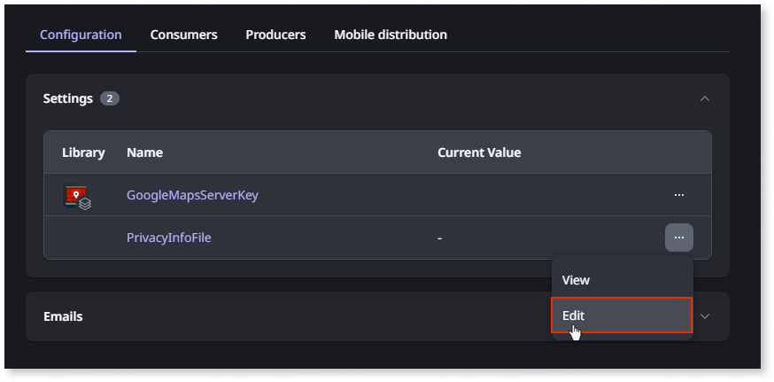

# Privacy updates for Apple App Store submissions

Apps submitted to the Apple App Store must include a privacy manifest file outlining the APIs employed and their purposes. When uploading a new or updated app to App Store Connect, include approved justifications for the APIs used in your code. Furthermore, when integrating a new third-party SDK, follow the API, privacy manifest, and signature requirements specific to that SDK. You must verify that the version employed includes its privacy manifest and note that signatures are compulsory when incorporating it as a binary dependency.

Your app or third-party SDK must declare one or more approved reasons that accurately reflect your use of each of these APIs and the data derived from their use. Use these APIs and their data for the declared reasons only. Ensure that your app's functionality, as presented to users, aligns with these declared reasons and that you don't use the APIs or derived data for tracking.

## Privacy manifest file

You must provide a PrivacyInfo.xcprivacy file in your OutSystems app, where the APIs used are detailed. Provided is a default file that can be used.

    <?xml version="1.0" encoding="UTF-8"?>
    <!DOCTYPE plist PUBLIC "-//Apple//DTD PLIST 1.0//EN" "http://www.apple.com/DTDs/PropertyList-1.0.dtd">
    <plist version="1.0">
     <dict>
     <key>NSPrivacyTracking</key>
     <false />
     <key>NSPrivacyTrackingDomains</key>
     <array />
     <key>NSPrivacyCollectedDataTypes</key>
     <array />
     <key>NSPrivacyAccessedAPITypes</key>
     <array>
     <dict>
     <key>NSPrivacyAccessedAPIType</key>
     <string>NSPrivacyAccessedAPICategoryFileTimestamp</string>
     <key>NSPrivacyAccessedAPITypeReasons</key>
     <array>
     <string>C617.1</string>
     </array>
     </dict>
     <dict>
     <key>NSPrivacyAccessedAPIType</key>
    <string>NSPrivacyAccessedAPICategorySystemBootTime</string>
     <key>NSPrivacyAccessedAPITypeReasons</key>
     <array>
     <string>35F9.1</string>
     </array>
     </dict>
     <dict>
     <key>NSPrivacyAccessedAPIType</key>
     <string>NSPrivacyAccessedAPICategoryDiskSpace</string>
     <key>NSPrivacyAccessedAPITypeReasons</key>
     <array>
     <string>E174.1</string>
     </array>
     </dict>
     <dict>
     <key>NSPrivacyAccessedAPIType</key>
     <string>NSPrivacyAccessedAPICategoryUserDefaults</string>
     <key>NSPrivacyAccessedAPITypeReasons</key>
     <array>
     <string>CA92.1</string>
     </array>
     </dict>
     </array>
     </dict>
    </plist>

## Providing a privacy manifest file in ODC

To create a binary setting in the browser:

1. In ODC Studio, in the **Data** tab, click **Settings**. Right-click and select **Add Setting**.

1. Name your file similar to "PrivacyInfoFile” and ensure the **Data Type** is set to `Binary Data` and **Publish**.

    

1. In the portal, navigate to **Apps,** and select your app.

1. On the **"PrivacyInfoFile"** dropdown list, select **Edit**.

    

1. Upload your PrivacyInfo.xcprivacy file and **Save**.

In ODC Studio, to configure your Extensibility Configurations:

1. Select **Edit app properties** > **Extensibility**.

1. Add the following entry:

    ```
    {
        "resources": {
            "ios": {
                "PrivacyInfoFile": {
                    "src": $settings.PrivacyInfoFile,
                    "target": "PrivacyInfo.xcprivacy"
                }
            }
        }
    }
    ```

1. The name of the object property inside `ios` and `src` must match the name of the setting. `Target` must be set to `PrivacyInfo.xcprivacy`. You can replace `PrivacyInfoFile` with any name.
