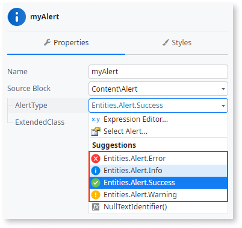
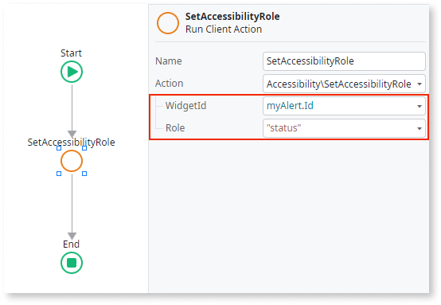
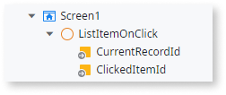
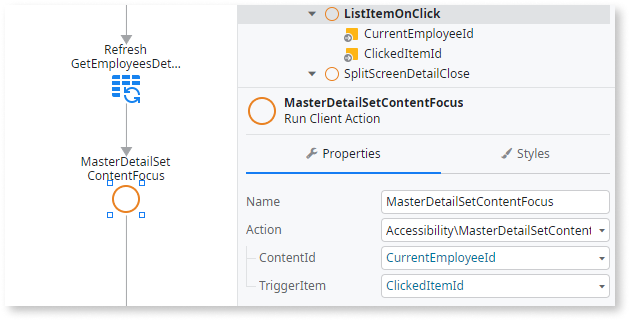
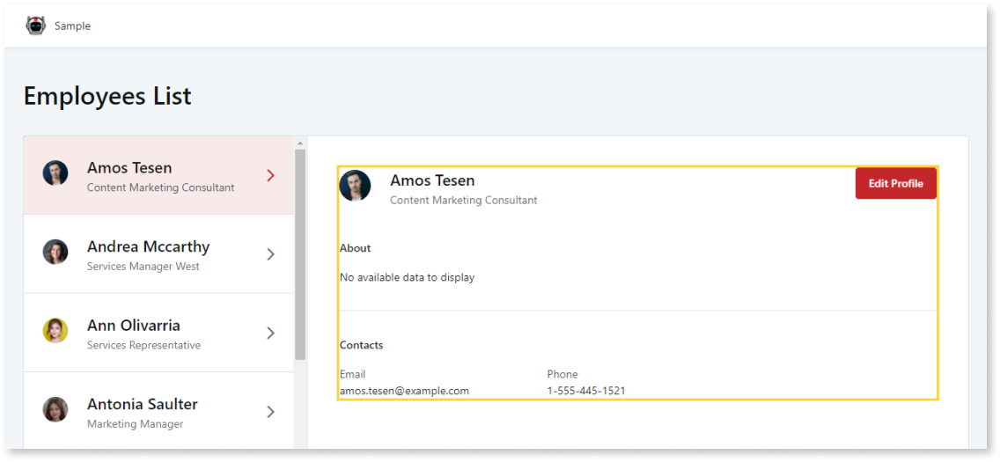

# UI Patterns accessibility reference

The OutSystems UI is in accordance with the WCAG 2.1. However, the UI patterns can introduce complex UI interactions in the app. These interactions may not be intuitive to the users of assistive technologies.

## Alert pattern

The Alert UI pattern lets you provide important information on the screen to get the users' attention. The alert pattern has different built-in ARIA roles, depending on the alert type:

* The ARIA role is **alert** when you set the **AlertType** property to **Entities.Alert.Error** or **Entities.Alert.Warning**.
* The ARIA role is **status** when you set the **AlertType** property to **Entities.Alert.Success** or **Entities.Alert.Info**.

    

The Alert pattern further supports changing the ARIA role with the **SetAccessibilityRole** action. Here's an example of how to set the ARIA role "status".

1. Select the Alert pattern, and on the **Properties** tab, in the **Name** field, enter **myAlert**. This is now the element identifier.
2. Open the logic flow that's relevant to the Alert showing on the screen.
3. Locate **Logic** > **OutSystemsUI** > **Accessibility** > **SetAccessibilityRole**. Drag the **SetAccessibilityRole** action to the flow.
4. In the **SetAccessibilityRole** action properties set **WidgetId** to **myAlert.Id** and enter **"status"** in the **Role** field.

While toggling the visibility of the Alert, you must update the **aria-hidden** attribute to guarantee the alert complies with the Accessibility guidelines. You can do this by using the **SetAriaHidden** client action.

## MasterDetail pattern

The **Master Detail** UI pattern splits the screen vertically into two panels. Clicking an item in the list pane opens the details pane.

### Configure the correct keyboard interaction

The Master Detail UI Pattern requires you to be careful with how the tab key behaves on the page. You should set **tabindex="0"** to the list section of the pattern, so the focus isn't lost elsewhere on the page. When the item in the list doesn't have text (you're using images), or the text isn't descriptive (you're using short text), use **aria-label** to provide more information to screen readers.

### Configure the correct switch of the focus

Make sure that the focus switches to the detail pane of the pattern. Use the action **MasterDetailSetContentFocus** available in **Logic** > **OutSystemsUI** > **Accessibility** to switch the focus, preferably after you populate the details pane with the data.

### Configuration instructions

To configure the Mater Detail pattern for accessibility, proceed with the following steps:

1. Open the **ListItem** pattern you are using.
1. Create an action on ListItem click, for example, **ListItemOnClick** with two input parameters:

    **CurrentRecordId** - to identify the current record

    **ClickedItemId** - to identify the Id of the clicked ListItem

    

1. On the **Properties** tab, add a **tabindex** attribute and set it to "**0**”.
1. Create an **aria-label** attribute, and add a descriptive text about the action after the aggregate, for example, **YourAggregate + " list item, click to open the detail".** You should also add an **onkeypress** event to  ensure keyboard navigation on the list item.

    

1. On the **ListItemOnClick** action, add the **MasterDetailSetContentFocus** action. You need this for accessibility compliance, as it allows to change the focus between the detail and the next **listitem**, with parameters mapped from the **ListItemOnClick**:

    1. **ContentID** (text) - Id of the content to focus on.
    2. **TriggerItem** (text) - Id of the clicked item.

    

### Demo

OutSystems recommends that you create a sample screen from the **Master Detail** Screen Template and check the accessibility settings in a working example.

