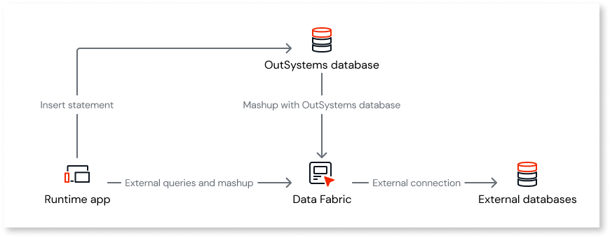
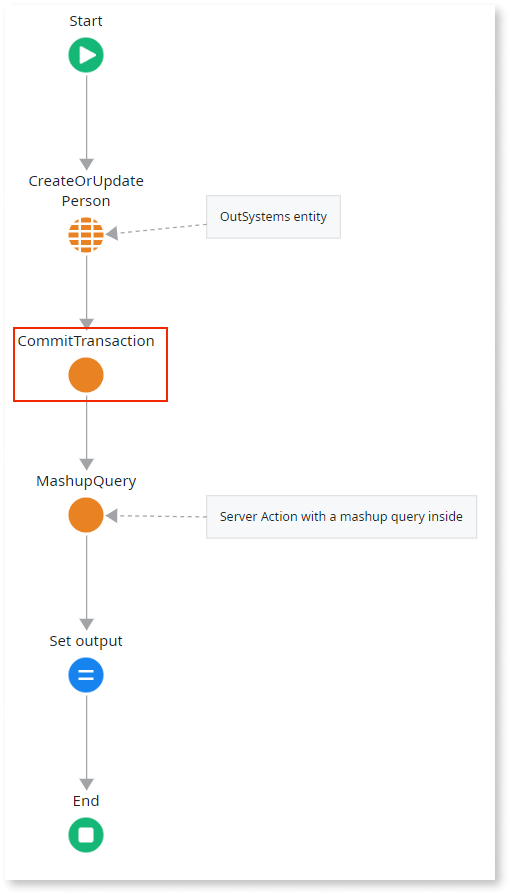
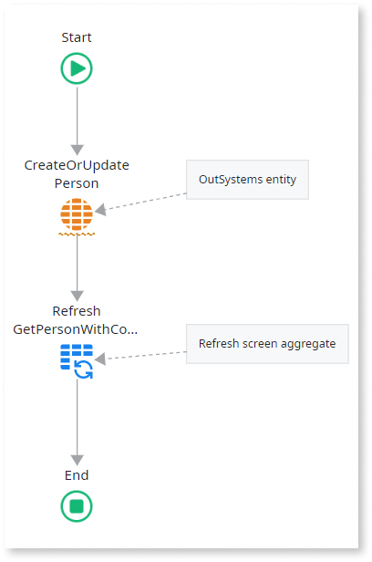

# Commit changes on the OutSystems database

When you insert a record into an internal entity and then combine an aggregate in the same flow with an external entity, the aggregate doesn't return the inserted record because mashup queries are executed in different transactions. This issue does not occur with queries using external connections to combine different data sources. External connections have auto-commit enabled. Transactions are not supported on integrations with external systems.

You should commit any changes to the OutSystems database before running mashup aggregates. This ensures the aggregate retrieves the inserted or updated record. This scenario applies to Server actions, Service Actions, Client Actions, Data Actions, runtime, and Timers. OutSystems recommends using the CommitTransaction Server Action when inserting or updating an OutSystems entity and then running a mashup query that includes the same entity.

Another scenario where the problem occurs is If you create or update an entity action for an OutSystems entity followed by a Server action with an aggregate to combine data from an OutSystems entity and an external entity. The aggregate won't return the newly inserted or updated record from the previous action.

If you run a create or update action for an OutSystems entity within a Client Action, and the aggregate is implemented at the screen level, the refresh aggregate returns the inserted or updated record. In this scenario, you do not need to use CommitTransaction.

To learn more about isolation in transactions, refer to [dirty transactions](../../../../reference/isolation.md). 
