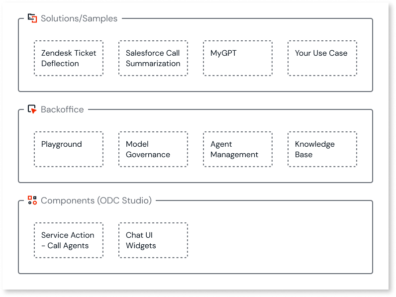
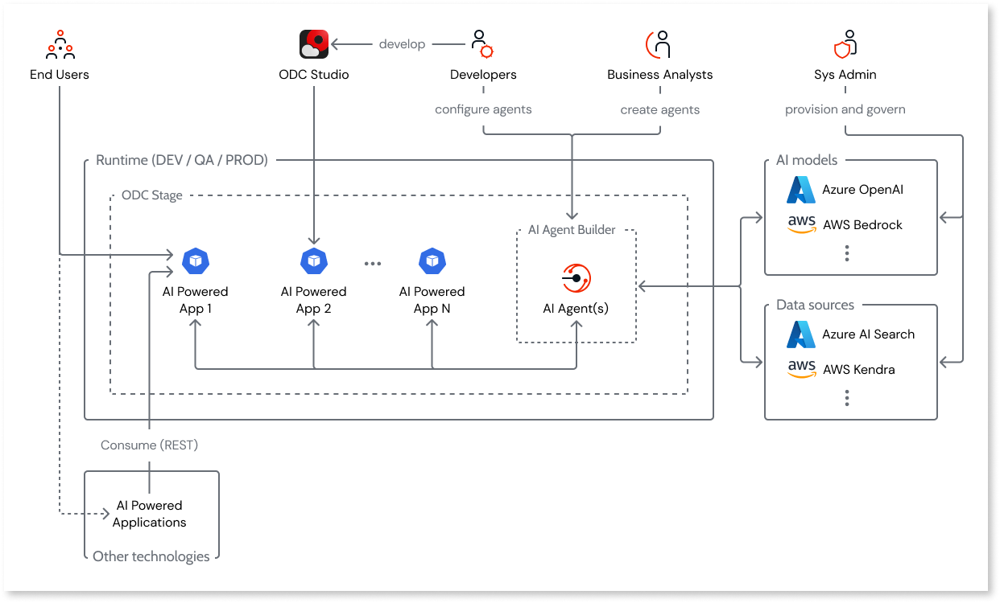

# About AI Agent Builder

The **AI Agent Builder** is a set of tools that you can use to build generative-AI applications in your app. You can create AI agents in the tool that leverages AI model and data sources along with the instructions you enter to deliver the desired response. 

You can access the AI Agent Builder as part of the OutSystems Developer Cloud (ODC) and download it from the Forge.  

When you build your agents and share them with your development team, the team better understands your goals which helps reduce the time to get your app to market. The generative AI built into AI Agent Builder enables you to:

* Integrate AI into your apps without a developer.
* Reduce costs because you don't need to upskill people on how to use AI.
* Contribute to the AI team by providing agents that solve your use cases.
* Inspire your teams to innovate and increase the number of automations once the team can quickly see how to integrate AI agents into an app.
* Control how your organization uses AI to ensure security.
* Create one agent that you can then use for multiple use cases.
* Create a UI using the logic from AI widgets.

## Terminology

The following is a list of terms to help you understand the AI Agent Builder tool.

* **Agent**: a set of configurations that make calls to an AI Model, along with the provided instructions and, optionally data sources.
* **Agent template**: is an example that you can use to guide you in creating an agent. **Users can't delete or add new default templates.** Only OutSystems can add or delete agent templates.
* **AI model**: the core of an Agent, that provides its generative AI capabilities. A model links to a specific AI provider (such as Azure or AWS).
* **Data source**: knowledge base or files from where the model fetches information to provide answers. An Agent can run without a data source and fetch answers directly from the model.
* **Downloadable Sample app**: An app that contains an OML file with entities, screens, a call to an Agent and an integration template for the external solutions in the app, such as Zendesk for Salesforce.
* **Instructions**: natural language text that instructs the model to perform a specific task. This influences the response such as the tone and structure of the answers it provides.

## AI Agent builder access

After you install and open the AI Agent Builder you get access to the homepage that displays the sample apps, templates, and agents. It also provides links to the AI Agent Builder, My Agents, and Configurations. With the AI Agent Builder, you get:

* **Solution/Sample** apps that you can use as a starting point to:
Learn how the sample apps use GenAI.
Make changes to any of the sample apps and see the results.
Download the OML from a sample app, and add it to your apps  to meet your needs.
Use AI UI widgets to speed up the process of creating your UI.  
* **Homepage** is your landing page,  from which you can:
    * Access the playground, an area in the AI Agent Builder, where you can verify the customizations and ensure your Agent is getting the correct data.
    * Access to your configurations for AI Models and Data Sources.
Build and manage agents for a specific use case by combining AI models, data sources, and instructions.
    * Create a new agent from scratch.
    * Access and use the agent templates to create a new agent
    * Access, modify and reuse agents you created.
    * Add data sources such as your company's documentation.
* **Components** provide access to agents such as a Call agent and Chat UI widgets. A Call Agent is a service action that connects an app to the AI Agent Builder so apps can send and receive responses using the defined Agent ID.

## Sample apps

The AI Agent Builder sample apps showcase different use cases of GenAI for business transformation and enable you to quickly build an app. Sample apps provide you with a starting point, in which you can make changes, and see how the app might work in your environment. The AI Agent Builder comes with several pre-built sample apps that solve a different use case.

For example, you might have an agent summarize a document or generate a document based on a prompt. In addition, you can have agents access your documentation and knowledge bases to provide more accurate information automatically.

The following sample apps provide you with information about the use case and where you can make modifications to meet your specific business case.

**Zendesk ticket deflection** app

* **Use Case**:  A support director wants to reduce the number of tickets the team receives and resolves in a day. This app shows how you can reduce the number of tickets by having AI answer questions and integrate with your Zendesk system to create  a ticket.
* **Solution**:  This app provides an external facing portal in which users interact with AI to automatically answer customer questions based on related documentation. Based on the response, users can then ask a more specific question. You can determine how you want AI to respond to the question. In this sample app, AI directs users to either ask a question or report an issue. AI bases the answer on the documentation in your data source. When none of the provided solutions work, a support ticket gets created.
* **Customizations**: You can create a data source with the documentation you want to provide to the ticket deflection. You can further customize this app and adapt it to work with different helpdesk software other than Zendesk, or just copy parts of the code into your existing customer support portal application.

**Salesforce call summarization** app

* **Use Case**:  Improve the efficiency of the sales team by using AI to summarize call transcripts and update customer/opportunity records within Salesforce. No data source is necessary for this app.
* **Solution**: A sales development representative (SDR) in your organization uploads a transcript from the sales call. The sample app processes this transcript and generates answers to questions from your lead qualification tool (such as MEDPICC). The SDR reviews the answers, edits them if necessary, and pushes them to their CRM app. This sample app also enables writing to Salesforce, doesn't include an API.
* **Customization**: Create an Agent to augment the AI model's answers before updating Salesforce, which overrides what exists before the call. You can download the OML of the full Sample App (including the Salesforce integration) to deploy and customize for your own needs. You can use the downloaded code option to further customize the application, such as to integrate it with a speech-to-text module for an end-to-end speech-to-CRM automation.

**MyGPT** app

* **Use Case**:  Companies want to enable their employees to access GenAI without using a public tool and to follow the corporate guidelines. The goal is for employees to be autonomous within the corporate guidelines. Employees use the model to ask questions and receive responses based on your company's documented process and procedures. The goal is to help employees perform tasks, find answers to customers questions, and learn about a process or procedure. You provide the data sources so that the responses follow your corporate guidelines.
* **Solution**:  This sample enables users to do such things as to use a document as the context for the Agent, access multiple data sources, or create their own instructions.
* **Customizations**: You can control which agents and data sources are accessible to users through an AgentID

## How information flows in the AI Agent builder

The AI Agent builder is an ODC app that runs in a stage and from the UI, users can interact with the apps.

You provision your own models and data sources. Information flows from the models and data sources using ID keys defined in the agent builder. With the use of an AgentID you can call one or more agents in the same stage. You can also use the pre-built Agents or create your own agents with the AI Agent Builder.

By exposing agents in an ODC app with a REST API, you can consume AI agents from other technologies such as high code, low code, and OutSystems O11.

