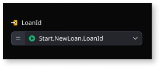

# Add wait 

When implementing your workflow, you can include a **Wait** node in your workflow that puts your workflow execution on hold until the** Close on** event occurs and certain configured conditions are met. 

When the **Close on** event occurs, and the configured conditions are met, the wait ends, and the workflow moves to the next step. For example, in a loan approval workflow, you can include a wait in a workflow until the credit score of a user is revised to a certain value and DocsVerified=OK. Once the credit score reaches a certain threshold and all documents are verified, the wait ends, and the workflow moves to the next step.

To include wait in a workflow, follow these steps:

1. From your workflow editor, click the (+) icon between two nodes and select the **Wait** process node.

1. Enter the following details in the sidebar:

    a. **Add description**: (Optional) Brief description of the wait and why it is needed in the workflow.

    b. **Close on**: (Mandatory) Select the event and define the conditions required to end the wait. You can specify one or more conditions for each event. 
    
    * The left side of each condition is always one of the event's input parameters.
    * On the right side, you can select either a literal value or a value from a drop-down list.
    * The condition is considered true when the left side equals the right side.

    
	
    If multiple conditions are defined, they are combined using the AND operator and evaluated together as True or False.

Once the event occurs and the conditions are met, the wait ends, and the workflow moves on to the next step.  
