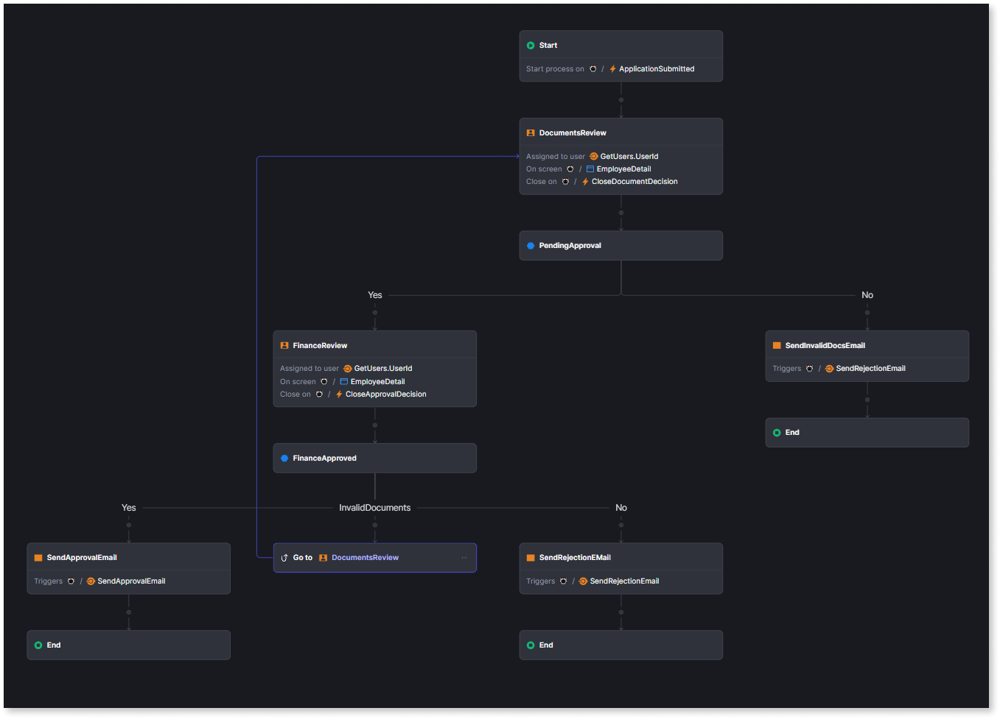

# Workflows in ODC

In OutSystems Developer Cloud (ODC), you can implement a [business process](business-processes.md) as a workflow. A workflow is a repeatable process consisting of tasks to be completed in a specific sequence. With workflows, you can implement business processes such as vacation approval and loan approval processes and integrate them into your apps. Workflows are created to introduce automation in your apps, encompassing the development and implementation of business processes. A workflow is designed as a flow of activities to be carried out, such as a task for the end-user to execute in your app or a task that executes without end-user intervention. 

You can implement workflows as a new type of asset similar to ODC apps and libraries with an independent lifecycle. ODC provides a **workflow editor**, a visual web-based tool for implementing workflows. You can access the workflow editor from the ODC Portal.  

To use workflows you need the requisite *Asset Management* permission(s). To get the necessary permission(s), speak to an administrator from your ODC organization.

With the workflow editor, you can:

* Implement your workflow using a set of nodes such as **Start**, **End**, **HumanActivity**, **AutomaticActivity, Go to a previous step,** and **Decision.**

* Establish a connection between the workflow and the app by selecting events, service actions, and screens for specific nodes in the workflow.

* Import and export workflows to share within your organization and with external partners.

Here's a video providing a concise overview of workflows.

<iframe src="https://player.vimeo.com/video/1027587143" width="750" height="422" frameborder="0" allow="autoplay; fullscreen" allowfullscreen="">This video provides a concise overview of ODC workflows</iframe>

Consider this example of approving a bank loan:

1. The workflow starts when a customer submits a loan application to the bank

2. A customer relationship manager manually validates the customer's background information.

   1. If the customer's background details are invalid, a rejection email is sent to the customer, and the workflow ends.

   2. If the user’s background details are valid, the loan application moves to the finance department, where an employee validates the customer's credit history and financial health.

      1. If the customer's financial documents are valid, then the customer receives a loan approval letter, and the workflow ends.

      2. If the customer's financial documents are invalid, then the customer receives a loan rejection letter, and the workflow ends.

      3. If the documents are insufficient, the finance department routes the application to the customer relationship manager to restart the document verification process.

    

For detailed step-by-step information about using workflows, refer to [Using workflows](using-workflows.md). 

## Key features

Workflows enable you to integrate the business processes in your ODC apps.

With workflows, you can:

* Streamline tasks that require manual intervention. For example, you can create tasks such as approval of loan documents and assign them to be carried out by the app's end users. 

* Automate repetitive tasks and notifications, leading to faster response times and better operational efficiency. For example, you can automate sending notifications once the loan documents have been approved.

* Include multiple conditional paths that route your business process based on specific criteria. For example, you can route your loan application business process to separate paths based on whether the loan documents were approved or rejected.

* Directly interact with your apps using events and service actions. For example, you can select an event in your app that, when triggered, can close a human activity.

## Use cases

Here are some use cases where you can use workflow for automation:

* Expense approval

* Vacation approval

* Fleet management

* Complaint management

* Loan approval

* Invoice approval

* Travel reimbursement

## Key considerations for implementing workflows

Here are some points to consider as you implement workflows in ODC:

* **Workflows are loosely coupled** to apps and can consume only the public elements from the app, such as events, service actions, and screens. To learn more about strong and weak dependencies, refer to [Understanding strong and weak dependencies](../reuse/intro.md). 

* **Workflows are always consumers** and not producers.

* **Workflows can be implemented, tested, and deployed across stages independent of ODC apps and libraries**. Because they rely on the app's public elements, they are subject to impact analysis. For detailed information about deploying workflows, refer to [Deploying assets](../../deploying-apps/deploy-apps.md).  

* **Workflows can have** [**multiple revisions**](../../deploying-apps/deploy-apps.md#multiple-revisions-of-a-workflow) **running simultaneously in the same stage**, and every revision can have one or more instances of the workflow in execution. An instance is a unit of execution of a workflow. Each instance can run up to 1,000 activities. 

    **Note**: In the development stage, you can have instances running only in the last five revisions. For example, if there are five revisions (revisions 1 to 5) in the development stage with active instances running in each one, once revision 6 is created, all active instances running in revision 1 are terminated immediately. There is no limit to the number of revision instances for the QA and production stages. 

## Known constraints

* Workflows **do not support real-time collaboration**, meaning multiple users cannot edit a workflow simultaneously. However, basic conflict detection is supported. If a new version of a workflow exists in dev, you are notified when you open it or try to publish your changes.

* There is **no debugger** for workflows. However, you can monitor the workflow's current state in the portal in near real-time.

## Related resources

* [Using workflows](using-workflows.md)
* [Workflow nodes](workflow-components.md)
* [Troubleshooting workflows](troubleshooting-workflows.md)
