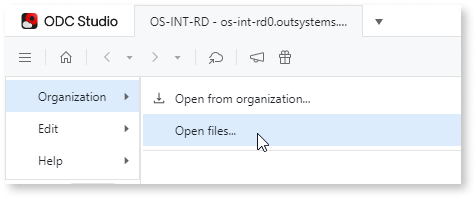

# Open an oml file in ODC Studio

An .oml file contains the code of an app or library. You can publish an .oml file to an ODC organization.

<iframe src="https://player.vimeo.com/video/1026075106" width="750" height="422" frameborder="0" allow="autoplay; fullscreen" allowfullscreen="">Opening an .oml file.</iframe>

Before starting, ensure you have ODC Studio connected to an ODC organization.
To open an oml file in ODC Studio, follow these steps:

1. In ODC Studio's main window, click the **Menu**.

    

1. Select **Organization > Open Files...**

    

1. In the popup, find and open the .oml file.

    

1. The app now opens up in ODC Studio.

1. Click the **1-Click Publish** button to publish the app for the first time.

    

## Export an oml file

With the app or library open in ODC Studio, you can export the .oml file by following these steps:

1. In ODC Studio's main window, click the **Menu**.

    

1. Select **App** or **Library** depending on whether you are working with an app or a library.

1. Select **Export** and then click **Save**.

1. Name the .oml file as required and save it to your desired location. 

You can also use the shortcut `Ctrl + s` on Windows or `Cmd + s` on macOS.
