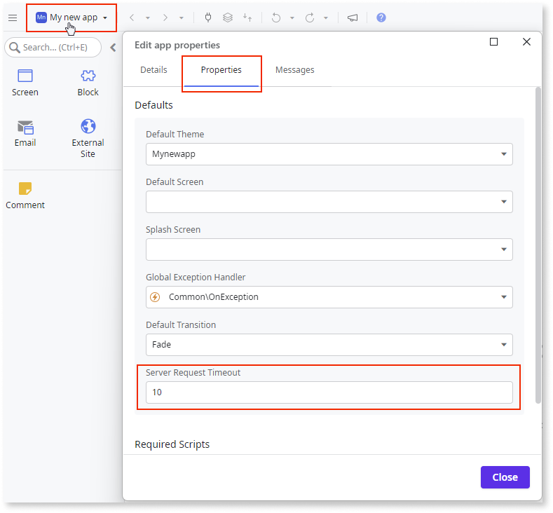

# OutSystems system requirements for ODC

This article provides recommendations for compatible tools and software versions that you can use with OutSystems Developer Cloud (ODC) Portal and ODC Studio.

To access ODC portal and connect to ODC Studio, ensure your local network allows access to `*.outsystems.dev` domains. For end-users to access ODC apps, their network must allow access to the `*.outsystems.app` domain or the [custom domain](../configuration-management/custom-domains.md) defined for each stage.

## ODC Portal

Use the most recent version of any of the following browsers:

* Edge
* Firefox
* Google Chrome
* Safari

## ODC Studio

Before you set up ODC Studio, make sure your computer meets the following requirements.

If you are working on a network where communications to the Internet are routed via an HTTP proxy, then refer to [How to configure HTTP proxy in ODC studio](configure-http-proxy.md) for configuration instructions.

### Minimum recommended hardware requirements

The following are the minimum recommended hardware requirements,however, keep in mind that many factors such as workload can affect performance.

* 1.8 GHz dual-core processor or better
* 2 GB of RAM (4 GB recommended)
* 1 GB of free disk space

### Operating systems

OutSystems supports the following Operating Systems. This list is subject to change. OutSystems supports Operating Systems for six months after the manufacturer's end-of-life date. For example, if your Operating System reaches its end-of-life on May 1, then OutSystems supports your operating system until November 1.

* macOS:
    * macOS Big Sur
    * macOS Monterrey

* Windows:
    * Windows 11 (64-bit) since ODC Studio 1.3.15
    * Windows 10 (64-bit)

### Requirements for client-side debugging

To perform client-side debugging in ODC Studio using a desktop browser, use the most recent version of any of the following browsers:

* Google Chrome
* Microsoft Edge

## Software requirements for app users

The following sections specify the software requirements for Apps developed in ODC. 

**End User Requirements**:  Support for OutSystems browser continues for 6 months after end of support date announcement. This support applies to all end-users running OutSystems on that particular browser.

### Web apps

Use the most current version of the following browsers:

* Edge
* Firefox
* Google Chrome
* Safari

### Progressive web apps

* The default browser for the most current stable version of Android.
* The default browser for the most current stable version of iOS.

### Native mobile apps

For more information about the latest supported Android and iOS platform versions and the minimum requirements to generate mobile apps, refer to [Mobile Apps Build Service (MABS)](https://success.outsystems.com/support/release_notes/mobile_apps_build_service_versions/)

## Request limits

The following are the request limits to keep in mind when you are building apps.

### Upload request size

The maximum size of an upload file request is 28.6 MB.

### Server request timeout

The maximum value of the **Server Request Timeout** property is 60 seconds for queries or actions initiated on the client side. The default value of the property is 10 seconds. You can change the default value in the app's property editor.

For queries or actions inside timer logic, the maximum timeout value is 60 minutes.

### Timers timeout

The maximum value of the **Timeout in Minutes** property is 60 minutes.
