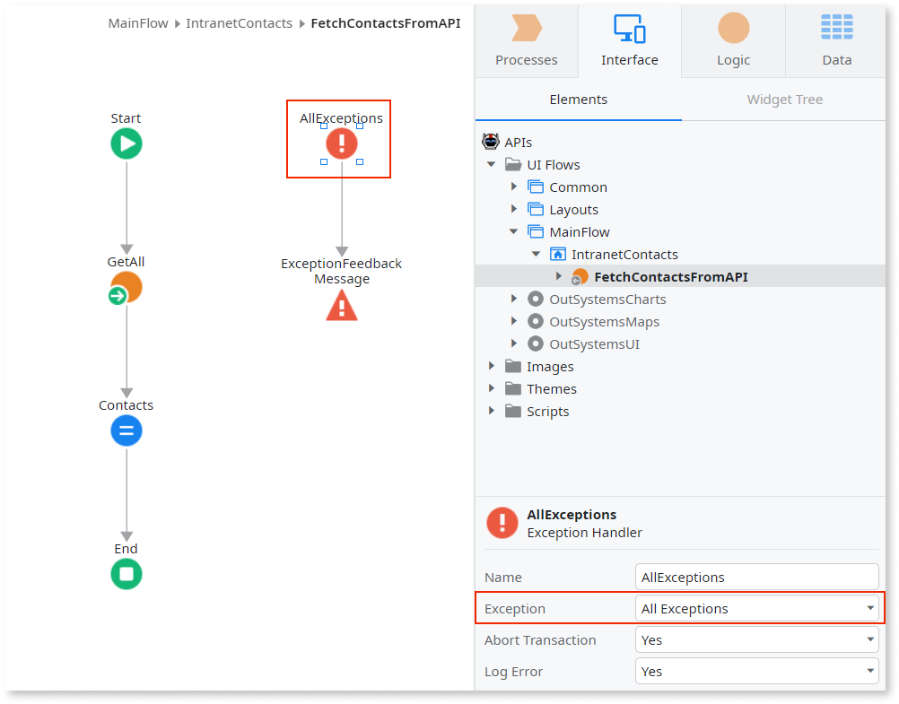

# Handling REST Errors

A web service error, including a REST error, occurs when there is a problem with the communication between a client and a web service. Web services allow different apps to communicate with each other over the internet or a network. When something goes wrong during this communication, an error occurs.

Web service errors typically manifest as HTTP status codes, with codes in the 4xx range indicating client errors (for example, 404 Not Found, 400 Bad Request) and codes in the 5xx range indicating server errors (for example, 500 Internal Server Error). If not handled correctly, these errors can disrupt the normal flow of your app, leading to a poor user experience.

Handling web service errors is critical to developing robust and reliable apps. When interacting with web services, various issues can arise, such as network failures, server errors, or bad responses. Properly managing these errors ensures that your app can handle unexpected situations and provide meaningful feedback to users. To effectively manage web service errors, you can implement error-handling mechanisms such as try-catch blocks, custom error messages, and logging. Additionally, it's essential to differentiate between recoverable and non-recoverable errors. Recoverable errors, such as temporary network issues, your app can retry, while non-recoverable errors, like wrong API keys, require your intervention.

When consuming a REST API method, if the service returns an HTTP error status code (400 and above), OutSystems throws an exception. This allows you to handle the REST API error response by implementing your own logic.

Handling webservice errors is crucial for ensuring a good user experience. When a webservice error occurs, follow these steps to manage the error and provide feedback to the end user:

1. **Detect the Error**: When a webservice call fails, capture the error status code and message. This can be done using exception handling mechanisms provided by ODC.

1. **Log the Error**: Record the error details in your logging system. This helps in diagnosing issues later and understanding the frequency and nature of errors.

1. **User Notification**: Inform the user about the error in a user-friendly manner. Avoid technical jargon and provide a clear message that explains the issue and any steps the user can take to resolve it.

1. **Retry Logic**: Implement a retry mechanism for transient errors. Sometimes, errors occur due to temporary issues like network instability. Retrying the request a few times can resolve the issue without user intervention.

1. **Fallback Mechanism**: Provide an alternative solution or a fallback mechanism if the webservice error persists. This could be displaying cached data or offering an offline mode.

## Catching and handling REST API exceptions

To handle a REST API error in ODC, you can do the following:

1. Add an Exception Handler to the logic that uses the REST API method, and set the **Exception** property to `All Exceptions` so that the exception handler catches all exceptions.

    

1. Implement the logic in the exception handler flow to handle the error, like displaying a message to the end user and logging the error.

## Manipulating received error responses

In certain situations, you might want to manipulate a REST error response at a lower level before OutSystems throws an exception.

You can do this by using the OnAfterResponse callback. These actions run before OutSystems processes the REST response, and you can use them to manipulate the response headers, body, and status code.

For example, you might want to:

* Throw specific User Exceptions based on the received error.

    

* Change the status code of a REST error response to 200 (success) so that OutSystems doesn't raise an exception in a specific case.
