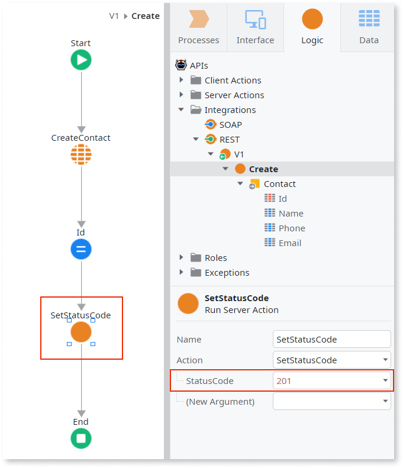

# Change the HTTP Status Code of a REST API

OutSystems uses [a set of built-in HTTP Status Codes](built-in-http-status-codes.md) in the Responses of your exposed REST API Methods.

However, there are situations where you might want to send a different HTTP Status Code. For example, when a record is successfully created, it's common to use the "201 Created" Status Code.

To set a different HTTP Status Code in the Response, do the following:

1. Go to **Manage Dependencies...** and add the [Response_SetStatusCode](../../reference/libraries/http.md#response_setstatuscode) action of the HTTP extension. 
1. Use the [Response_SetStatusCode](../../reference/libraries/http.md#response_setstatuscode) action in your REST API Method or callback flow right before the end node. 
1. Set its "StatusCode" property to the desired status code. 

