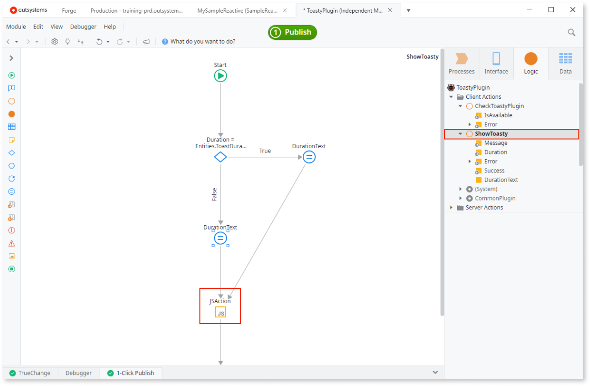
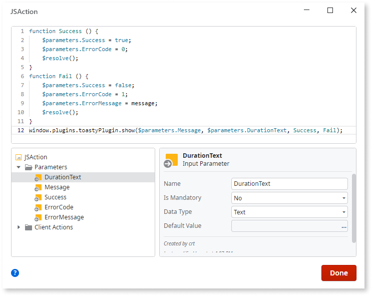

# Using Cordova plugins

<div class="info" markdown="1">

Applies only to Mobile Apps.

</div>

You must wrap Apache Cordova plugins into apps to reference them in your mobile apps.

To wrap Apache Cordova plugins into apps, do the following:

1. Clone the [Template Plugin from Forge](<https://www.outsystems.com/forge/component-overview/1676/template-plugin/>) that provides the groundwork for all custom Cordova plugins.
1. Wrap each plugin in its own dedicated app; if using several plugins, create an app for each, containing a single wrapper app.
1. Make the relevant actions and entities of the wrapper app public.
1. Provide a meaningful name for the wrapper app. For example, "SamplePlugin".

You can test the functionality of Cordova plugins only in native mobile apps.

This document provides detailed information on how to wrap an existing Cordova plugin into aa app.
For detailed information about creating and wrapping your own Cordova plugin, refer to the blog post [How to Create a Cordova Plugin from Scratch](<https://www.outsystems.com/blog/posts/how-to-create-a-cordova-plugin-from-scratch/>).

## Reference Cordova plugins

Wrap a Cordova plugin using the **Extensibility Configuration** property. Specify the plugin with one of these keys in the JSON settings:

* **Public repository URL:**  the value of the `url` key.
* **Cordova identifier:** the value of the `identifier` key.
* **ZIP file:** from **Resources** folder in the **Data** tab (the value of the `resource` key)

Unless it's a [plugin supported by OutSystems](intro.md) and you're using a public repository to reference the plugin, consider forking the plugin repository or using a tagged version, such as `https://example.com/sampleplugin/sampleplugin.git#1.1.0`.

This approach prevents breaking changes in the plugin and the apps using it. Additionally, without tags, two different builds might produce different results. This is crucial when deploying across multiple environments, where testing in one environment could invalidate a different build in another environment.

Use the JSON for additional settings required by the plugin. For the full description of the JSON, refer to [Extensibility Configurations JSON Schema](../../building-apps/mobile/extensibility-configurations-json-schema.md).


### Reference the plugin

This is a sample JSON file for the **Extensibility Configuration** property. Note that you can use only one of the plugin references in the `plugin` key: `url` or `identifier` or `resource`.

A plugin from the npm registry:

```javascript
{
    "plugin": {
        "identifier": "sampleplugin"
    }
}
```

A plugin from a git repository:

```javascript
{
    "plugin": {
        "url": "https://example.com/sampleplugin/sampleplugin.git#1.1.0"
    }
}
```

### Configure the plugin

If you need to set plugin configurations for each app, use settings to configure your plugin. For detailed information, refer to the [Extensibility Configurations page](../../building-apps/mobile/extensibility-configurations.md).

#### Define plugin preferences

If the plugin needs additional arguments during installation, provide [cordova plugin variables](https://cordova.apache.org/docs/en/11.x/plugin_ref/spec.html#preference) in the `name` and `value` key-value pairs.

Here is an example:

```javascript
{
    "plugin": {
        "url": "https://example.com/sampleplugin/sampleplugin.git",
        "variables": [
            {
                "name": "<plugin_var1>",
                "value": "<value_var1>"
            },
            {
                "name": "<plugin_var2>",
                "value": "<value_var2>"
            }
        ]
    }
}
```

#### Define application preferences

If the plugin needs additional arguments at runtime or as an application preference, inject `<preference>` tags in the config.xml by supplying them in the preferences object `name` and `value` key-value pairs.

These preferences might clash with those defined in other plugins or the main module of the consumer application, so the following merging rules apply:

1. If a plugin defines preference `ExamplePreference` and it already exists in the App extensibility, the App `ExamplePreference` value remains.

1. If multiple plugins define the same preference `ExamplePreference`, the first plugin installed sets the value for the preference.

Here is an example:

```javascript
{
    "plugin": {
        "url": "https://example.com/sampleplugin/sampleplugin.git",
    },
    "preferences": {
        // Common preferences for iOS and Android
        "global": [
            {
                "name": "<The preference name for your Android/iOS application>",
                "value": "<The preference value for your Android/iOS application>"
            },
            /* ...more global preferences... */
        ]
        "android": [...],
        "ios": [...]
    },
}
```

## Wrapper app structure

Each plugin must have a `Check<Capability>Plugin` action (such as "CheckToastyPlugin") with an **IsAvailable** output parameter of type Boolean. This lets you check to verify the plugin is available in the target module.

Create actions, such as **ShowToast**, within the wrapper app and add a JavaScript flow element with the variables. Make the actions public so that they're available in the application. Write descriptions for all public actions, inputs, and outputs. This aids in using the module in the target application.



Code inserted to connect the wrapper to the Cordova plugin in a JavaScript element:



## Custom hooks

Starting from **MABS 10** you can create custom error messages. For example you can create a custom error message when a plugin is installing or even when the build starts.

This makes troubleshooting easier and provides a better user experience for each plugin. A good way to achieve this is to have a hook stopping the build with a message starting with the pattern `OUTSYSTEMS_PLUGIN_ERROR:`.

If the error occurs at the plugin installation step, the message identifies the plugin and the error code as `OS-MABS-PLG-40021`. However, if the error is at the build step, the error code is `OS-MABS-GEN-40022` and the error message won't contain the plugin ID by default.

For example, to have your plugin failing in the installation with either of the following experiences,


you require:

1. A hook on your plugin, running at either the installation or build phases. For detailed information, refer to [hook phases](https://cordova.apache.org/docs/en/11.x/guide/appdev/hooks/).
1. A hook to log the error in the format `OUTSYSTEMS_PLUGIN_ERROR:`. This example, shows the code for the hook:

```
module.exports = function (ctx) {
    console.log("RUNNING HOOK NOW!");
    ...
    throw new Error(`OUTSYSTEMS_PLUGIN_ERROR: Error occurred on ${ctx.hook}`)
};
```
