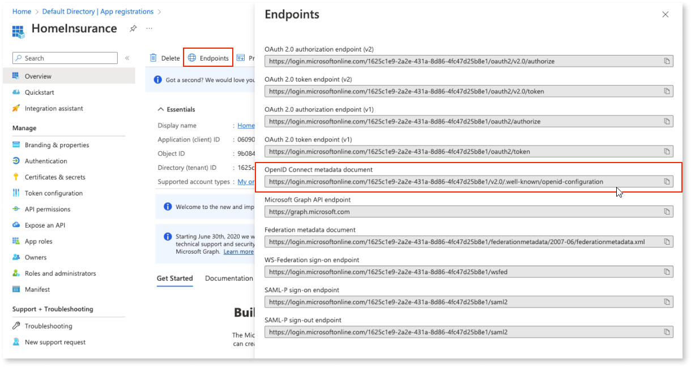
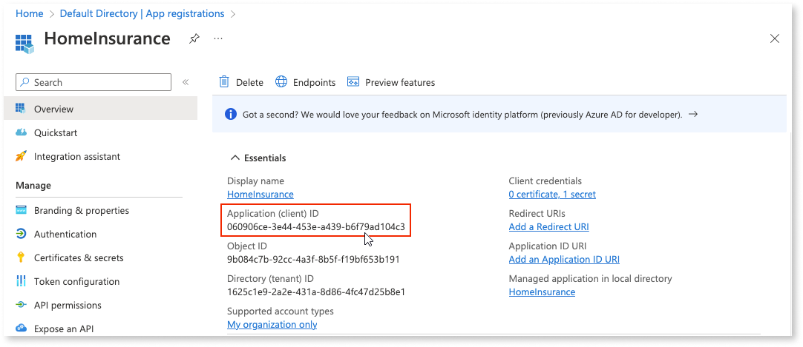
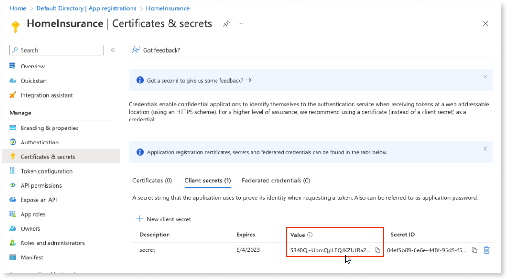

# Add Azure AD for use as external identity provider

ODC admins can configure Azure AD as an external IdP by going to the ODC Portal and selecting the **Identity providers** tab.

To launch the **New provider** configuration screen, click the **Add Provider** > **OpenID Connect** button. Now follow these steps:

1. Enter a name for the new provider in the **Provider name** field. This can be any name less than 255 characters and can't include special characters.

1. Login to the [**Azure Portal**](https://portal.azure.com/) and create a new app registration in the Azure Active Directory screen. For guidance, see Microsoft documentation [here](https://learn.microsoft.com/en-us/azure/active-directory/develop/quickstart-register-app).

1. Open the app registration you created and click the **Endpoints** button. Copy the URL from the **OpenID Connect metadata document** field and paste it into the **Discovery endpoint** field in ODC Portal.

    

   

    Some Azure AD configurations issue custom signing keys for their tokens, which requires using an app-specific discovery endpoint. An example of such an endpoint is `https://login.microsoftonline.com/{tenant}/discovery/.well-known/openid-configuration?appid={appid}`, where `{appid}` corresponds to the **Application (client) ID**. You can get **Application (client) ID** in the following steps. If you face errors while authenticating with Azure AD, using custom signing keys may be a solution. For more information, refer to [Validate the signature](https://learn.microsoft.com/en-us/entra/identity-platform/access-tokens#validate-the-signature) by Microsoft.

   

1. Click **Get details** in ODC Portal. This retrieves the JSON of the Azure AD OpenID configuration and shows a preview.

1. Copy the value of the **Application (client) ID** field from the main screen of the app registration in Azure Portal and paste it into the **Client ID** field in ODC Portal.

    

1. Click the **Certificates & secrets** tab from the main screen of the app registration in **Azure Portal**. Click **New client secret** button. Enter a description for the new secret in the **Description** field and then click **Add** to generate the secret.

    

1. Copy the newly generated value from the **Value** field and paste it into the **Client secret (secret value)** field in ODC Portal.

    

    

    ODC safely stores the configuration details in a secret manager.

    

1. Copy the pair(s) of **Redirect URLs** to the list of permitted redirects in the setup part of your external provider. Copy the pair(s) for the built-in and active [custom domains](../custom-domains.md). If configuring [Okta](okta.md), you can follow the embedded link for specific guidance. Otherwise, see your provider's support documentation for further guidance. For example, [Azure AD](https://learn.microsoft.com/en-us/entra/identity-platform/quickstart-register-app#add-a-redirect-uri). Click **Next**.

1. Complete the configuration in ODC Portal by leaving the **PKCE** as the default value (**SHA-256**) and fields in **Claim Mapping** section as default values (**name**, **email**) and clicking **Save**.

1. To enable additional Claims, such as JWT Tokens via Claims Mapping Policy in Azure AD, manually add the required property to the app manifest configuration on Azure AD. For more information, see [Adding user optional and mapped claims in the Azure AD authentication token](https://devblogs.microsoft.com/premier-developer/adding-user-optional-and-mapped-claims-in-the-azure-ad-authentication-token/).

ODC tests the configuration and on success adds Azure AD to the list of available providers. If the test fails, a notification with the error displays.

Now follow the steps [here](intro.md#apply-an-external-idp) to apply for the newly added Azure AD provider for use by your organization or apps.
