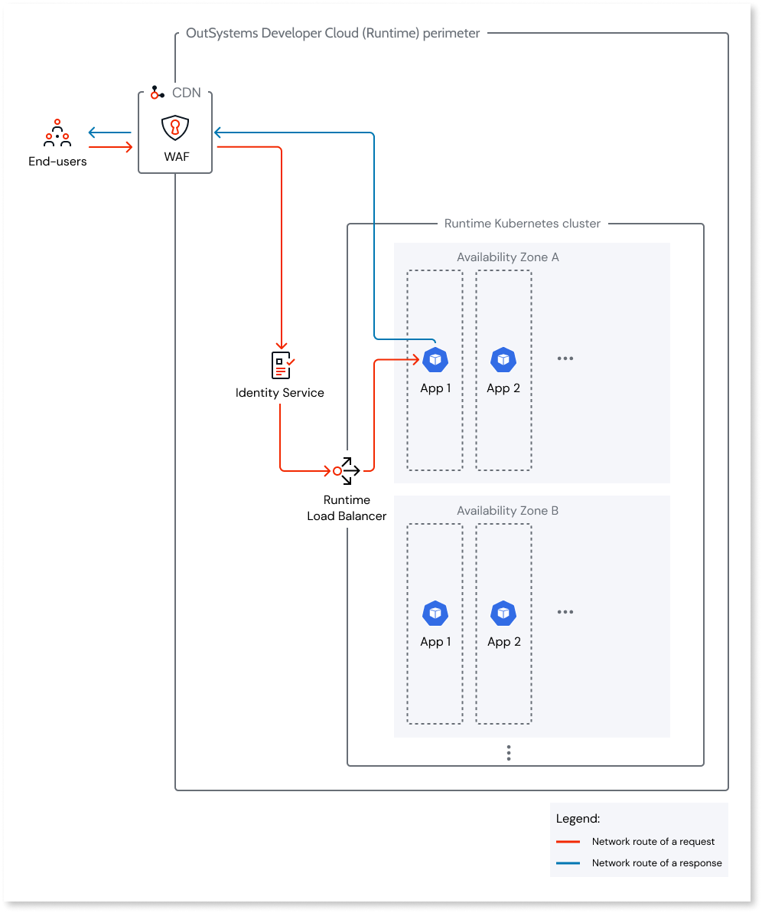

# Network architecture of OutSystems Developer Cloud

This article provides an overview of OutSystems Developer Cloud (ODC) cloud-native network architecture and security.

ODC is cloud-native. This means that the infrastructure of both the development Platform, for building and deploying apps, and the independent Runtime, for hosting and running the deployed apps, live in the cloud. See [Cloud-native architecture of OutSystems Developer Cloud](intro.md) to learn more.

A secure cloud-native network connects the cloud-native architecture. The network architecture of the Development, Test and Production stages of the Runtime is identical.

## Key technologies

The following is an overview of the cloud technologies that OutSystems Developer Cloud (ODC) uses for networking and network security.

### Content Delivery Network

The ODC CDN (Content Delivery Network) is a globally distributed set of servers that ensures a low network latency for routing requests. The CDN caches your apps' static files, reducing end-user load times. Files can be static or dynamic. Static files (such as images or JavaScript) don't change often. Dynamic files can change with each user interaction.

The CDN verifies the public key certificate attached to the request: `outsystems.dev` for the Platform and `outsystems.app` or the [custom domain](../custom-domains.md) used for the Runtime.

#### Web Application Firewall

The Web Application Firewall (WAF) runs on the CDN and protects the Platform and the Runtime against common web exploits and bots.

For more information see [Security in OutSystems Developer Cloud](../../security/security.md#web-application-firewall).

### NATS

All internal requests between the Platform and Runtime stages get made through NATS (Neural Autonomic Transport System), a secure messaging system. This protects private endpoints from external access.

### Identity Service

The Identity Service verifies that each request comes from an [authenticated and authorized user](identity.md).

### Load Balancer

When the Platform Load Balancer receives a request, it routes it to the target endpoint of the target multi-tenant Platform service. The Load Balancer directs the request to a service container replica using the round-robin method.

When the Runtime Load Balancer receives a request, it routes it to the target endpoint of the target app container. The Load Balancer directs the request to an app container replica in a given Availability Zone (AZ) using the round-robin method.

## Request route

Requests to both the Platform and Runtime first go through the CDN, responsible for routing the request. The WAF runs on the CDN and filters malicious requests. In the case of a Platform request, the request gets routed to the target endpoint of the target multi-tenant Platform service. In the case of a Runtime request, the request gets routed to the target endpoint of the target app. The intermediaries between the CDN and the endpoint are the Identity Service, responsible for user identity authentication and authorization, and Load Balancer.

Each request is HTTPS so fully encrypted using Transport Layer Security (TLS).

In the network architecture, the data of both the Platform and Runtime for each customer is network isolated. Each Kubernetes cluster running in each Runtime stage is namespace-isolated, meaning each customer's app containers are network isolated.

Requests to external data (available via REST API) get routed through a NAT gateway, one per AZ, each with a public IP address.

### Platform

The Platform uses microservices based on REST API. When ODC Studio and ODC Portal send HTTPS requests, the requests reach the secure endpoints that the Platform exposes. The requests use the smallest network bandwidth for the data transfer.

An example of an HTTPS request is when a developer clicks the 1-Click Publish button in ODC Studio. The request accesses a secure endpoint in Build Service.

The platform is available at `<customername>.outsystems.dev`.

### Runtime

Apps run as app containers in the Runtime with secure REST API endpoints. HTTPS secures the communication between the client and the browser. 

An example of an HTTPS request is when a user submits a form in an app. The request accesses a secure endpoint that the app container exposes.

The apps are available at `<customername>.outsystems.app/appname` and on all the active custom domains (such as `apps.example.com/appname`).

 
