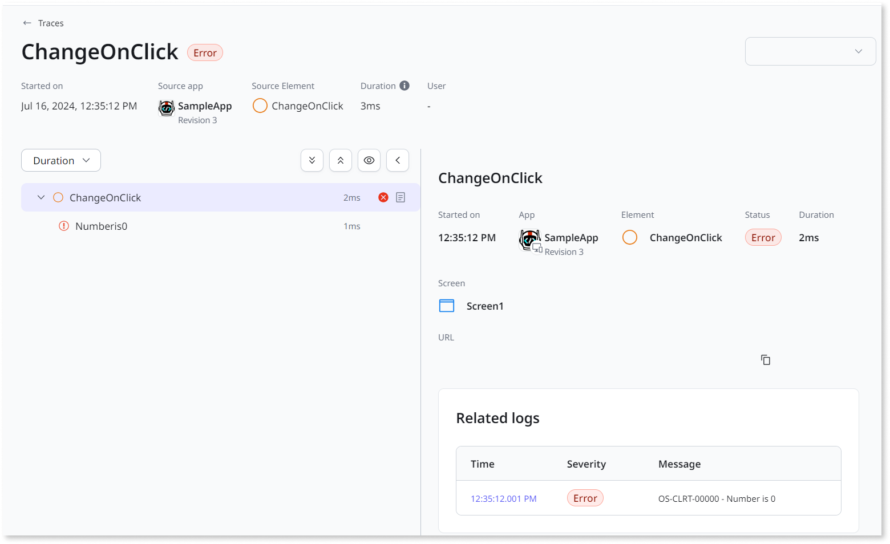

# Client-side traces 

Client-side traces allow you to analyze client-side execution. This provides insights into elements such as Blocks or Client actions. With client-side traces, you can:

* Identify which span contains an error. Use the ODC Portal to find the root cause, then go to ODC Studio to fix it.
* Monitor requests to get detailed information about user interactions.
* Understand the performance of each span in the app and its dependencies. Modify the elements associated with slower spans to improve the app's performance.

For more information about backend traces, refer to [Traces](traces.md).

The following are different types of client-side traces:

* Block - Linked to the Block language element covering the screen's load period and containing event actions. It also includes the block's disposal period and the OnDestroy event action of the block.
* Client Action - Linked with Client Actions, Client Screen Actions, and System Client Action language elements.
* Client Exception Handler - Linked to the OnException action language element.
* JavaScript - Linked to the JavaScript language element.
* Required Scripts - Linked to the RequiredScripts language element.
* Screen - Linked to the render (either initial render or a re-render) of a screen or part of it. Screen traces contain the screen's disposal period and the OnDestroy event action of the screen.
* System Event - Linked the ApplicationReady and ApplicationResume system events.

## Enable client-side traces

Before enabling client side traces, refer to [considerations working with client-side traces](#considerations). You must publish or deploy the app to view traces.

All apps have their client-side traces off by default. The following steps describe how to enable client-side traces:

1. From the home page of the ODC portal, click **Apps**. A list of all apps displays.

1. Select the app for which you want to enable client-side traces.

    

1. Go to **Monitoring & Troubleshooting** under the **Configuration** tab, then click **Activate client-side tracing** to enable client-side traces.

## Working with client-side traces

Consider the following information while working with traces:

### Missing traces or spans

The ODC Portal initially displays traces of the order in which they arrive. Spans in a processing state may appear later with a visual indicator. Select **Monitoring** > **Traces** and click **Refresh** to view the most current information.

Backend traces typically arrive first. When client-side traces arrive, they regroup with the backend traces. However, client-side information may sometimes not arrive due to an error or a limit being reached. In these cases, only traces with backend information remain available.

### Out-of-order spans

Client actions can execute in less than a millisecond. This makes it appear that two actions happened simultaneously. In the ODC Portal, spans are displayed based on arrival time, which can cause consecutive actions to appear out of order.

### Empty block

When an action is called, a span is created even if the action doesn't affect your app. Some spans occur without a clear impact, such as exception handlers. For example, an exception handler can handle an expected exception without displaying any errors.

If an exception triggers the handler, ODC records a span, even if it doesn't result in errors. This also applies to other elements, such as action spans.

### Multiple spans after an interaction

Screen traces monitor the rendering of a screen, whether it's the initial render, a subsequent update, or a part of the screen. ODC records a screen render as part of the initial screen. Any subsequent changes to the initial screen lead to new re-renders, each creating a new span in the trace. Typically, the following actions can lead to a screen span:

* A screen variable changes.
* There is a change in the state of a screen aggregate or data action.
* The user navigates to a new screen.
* The internal state of a widget on the screen changes.

## Considerations working with traces { #considerations }

Client-side spans are collected and stored on the client side and sent to the ODC data service in batches of up to 1000 spans. Trace requests are rate-limited, and all spans within trace requests that exceed these limits are discarded.

## Limits and known limitations

Consider the following limitations when working with client-side traces:

* You can activate client-side traces only for apps published on or after August 8, 2024. You must publish or deploy the app to view traces.
* End users might experience performance degradation when navigating between different pages provided by different apps.

If your end users experience performance issues or are unable to log in to an app. OutSystems recommends not turning on client-side traces.
