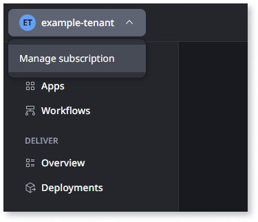
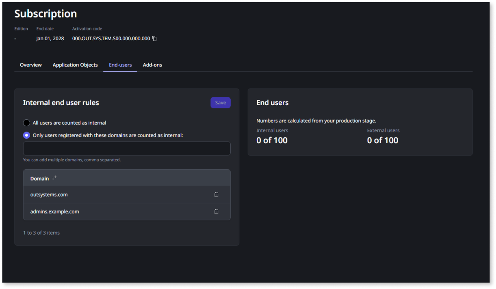

# Classify users in ODC

In ODC by default all end users are considered internal until you configure specific domains that you own in ODC Portal.

Any users with an email address matching those domains are classified as internal, and any other email domains are classified as external. This is important since as [internal and external end-user capacities are licensed separately](https://www.outsystems.com/tk/redirect?g=907b0fd3-bc46-4391-aae2-673296d795d9). 

## How to configure your domains

1. In the ODC Portal access your Manage Subscription console, by clicking on your tenant name and then clicking on Manage subscription:
    
    

1. Select the **End-users** tab  

1. Under **Internal end-users rules** select **Only users registered with these domains count as internal** and type the domain names that you own.

1. Click **Save** to add your domains.

    

After saving your changes, the process of calculating the current internal and external end users starts, which might take a few minutes. Your number of internal and external users is recalculated every 24h.

